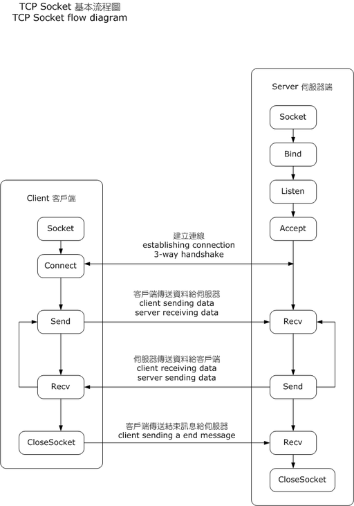

# socket



TCP Socket Flow [fuente de la imagen](https://commons.wikimedia.org/wiki/File:InternetSocketBasicDiagram_zhtw.png)

Crea un objeto de socket que admite el tipo de administrador de contexto , por lo que puede usarlo en una declaración with . No hay necesidad de llamar **close()** :

```python
socket()
```

Se usa para asociar el socket con una interfaz de red específica y un número de puerto :

```python
bind()
```

Permite que un servidor realice conexiones **accept()**. Lo convierte en una toma de escucha :

```python
listen()
```

 Boquea y espera una conexión entrante. Cuando un cliente se conecta, devuelve un nuevo objeto de socket que representa la conexión y una tupla que contiene la dirección del cliente.

```python
connect()
```

Igual a **connect()**, pero devuelve un indicador de error en lugar de generar una excepción para los errores.

```python
connect_ex()
```

Para enviar su mensajes.  

```python
send()
```

para recibir mensajes.

```python
recv()
```

Cierra una conexion.

```python
close()
```

## servidor

```python
#!/usr/bin/env python3

import socket

HOST = '127.0.0.1'  # Standard loopback interface address (localhost)
PORT = 65432        # Port to listen on (non-privileged ports are > 1023)

with socket.socket(socket.AF_INET, socket.SOCK_STREAM) as s:
    s.bind((HOST, PORT))
    s.listen()
    conn, addr = s.accept()
    with conn:
        print('Connected by', addr)
        while True:
            data = conn.recv(1024)
            if not data:
                break
            conn.sendall(data)
```

## Cliente

```python
#!/usr/bin/env python3

import socket

HOST = '127.0.0.1'  # The server's hostname or IP address
PORT = 65432        # The port used by the server

with socket.socket(socket.AF_INET, socket.SOCK_STREAM) as s:
    s.connect((HOST, PORT))
    s.sendall(b'Hello, world')
    data = s.recv(1024)

print('Received', repr(data))
```
